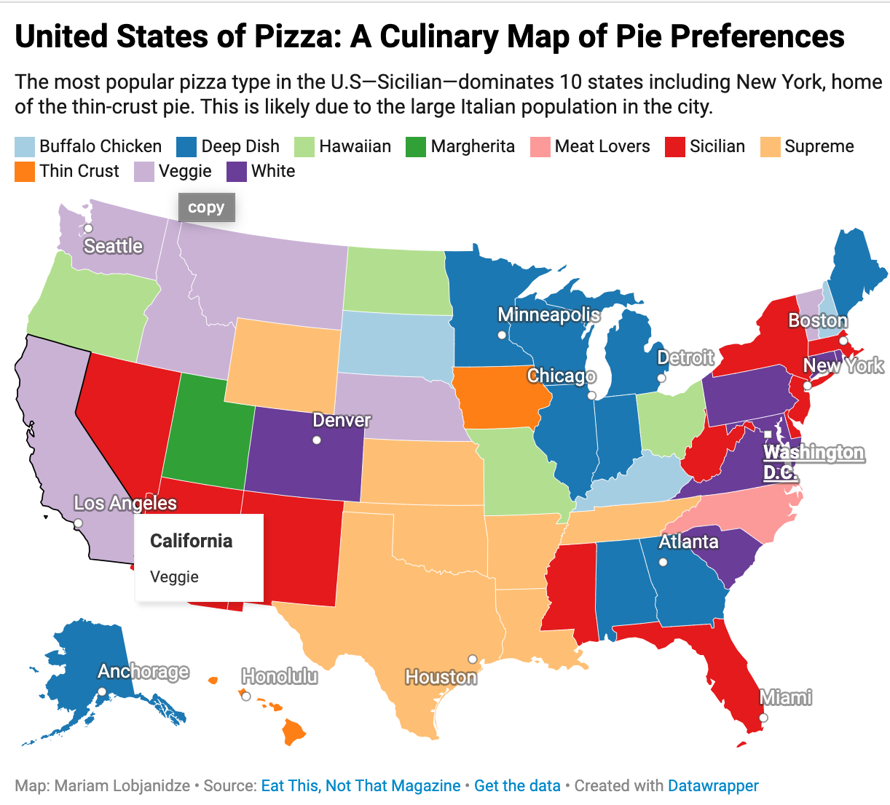

# Hi, I'm Mariam Lobjanidze!

## About Me

I'm a journalist based in New York City specializing in covering business stories through the lens of data. I am currently pursuing an M.S in Data Journalism. On this website, you can find my data projects. 

## Contact

Feel free to reach out to me at [ml4998@columbia.edu](mailto:ml4998@columbia.edu)

## Projects

### BBC 21st century greatest films

<table>
  <tr>
    <!-- Image cell -->
    <td>
      
    </td>
    <!-- Text cell -->
    <td>
      In the BBC movie project, I scraped this BBC website using Beautiful Soup, Playwright, and regular Expressions. As a result, I created a searchable database (multiple CSV files) that includes a list of all the directors from the website, movie names, critic names, director nationalities, and links to their homepages on IMBD.
    </td>
  </tr>
</table>
   

### [United States of Pizza](https://ml4998.github.io/Pizza-styles/)

<table>
  <tr>
    <!-- Image cell -->
    <td>
      
    </td>
    <!-- Text cell -->
    <td>
      The project includes two kinds of data visualizations: a map that has data on what kind of pizza is the most popular in each state and a chart that includes what kinds of pizza are the most popular and the least popular in each country. To complete this project, I manually created two CSV files that have the following data: the number of states that favor a certain style of pizza and what kind of pizza each state favors. I used Datawrapper to generate data visualizations.
    </td>
  </tr>
</table>

